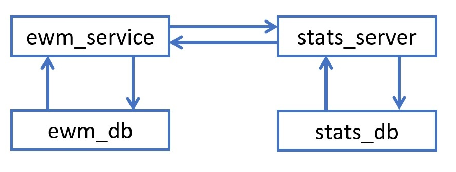
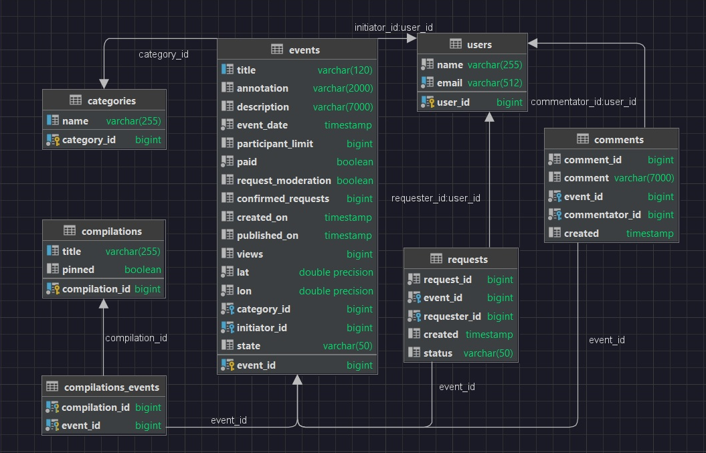
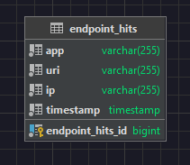

# Java-explore-with-me
Template repository for ExploreWithMe project.
https://github.com/KhorkovRoman/java-explore-with-me/pull/1

### Описание

Приложение — это афиша, где можно предложить какое-либо событие от выставки до похода в кино и набрать компанию для участия в нём.

Приложение выполнено на основе микросервисной архитектуры. Для запуска приложения необходимо запустить команду docker-compose up.

##### Сервисы доступны по адресам:

основной сервис : localhost:8080

база данных основного сервиса: jdbc:postgresql://ewm-db:5432/ewm_service

сервер статистики: localhost:9090

база данных сервера статистики: jdbc:postgresql://stats-db:5432/stats_server

### Два сервиса

Основной сервис — содержит всё необходимое для работы продукта.

Сервис статистики — хранит количество просмотров и позволяет делать различные выборки для анализа работы приложения.

#### Схема взаимодействия основного сервиса и сервиса статистики, взаимодействие с базами данных.

### Основной сервис

API основного сервиса разделен на три части. 

* Публичная - доступна без регистрации любому пользователю сети. 
* Закрытая - доступна только авторизованным пользователям.
* Административная - для администраторов сервиса.

#### Требования к публичному API

* Предоставлять возможности поиска и фильтрации событий.
* Сортировка списка событий организована либо по количеству просмотров, которое должно запрашиваться в сервисе статистики, либо по датам событий.
* При просмотре списка событий возвращается только краткая информация о мероприятиях.
* Просмотр подробной информации о конкретном событии настроено отдельно (через отдельный эндпоинт).
* Каждое событие относится к какой-то из закреплённых в приложении категорий.
* Возможность получения всех имеющихся категорий и подборок событий (такие подборки будут составлять администраторы ресурса).
* Каждый публичный запрос для получения списка событий или полной информации о мероприятии фиксируется сервисом статистики.
* 
* Возможность просматривать комментарии пользователей.
#### Требования к API для авторизованных пользователей

*   Добавлять в приложение новые мероприятия, редактировать их и просматривать после добавления.
*   Подача заявок на участие в интересующих мероприятиях.
*   Создатель мероприятия должен иметь возможность подтверждать заявки, которые отправили другие пользователи сервиса.
* 
* Возможность оставлять комментарии к собитию.
* Возможность изменять и удалять комментарии к событию.
* Возможность просматривать список всех своих комментариев.

#### Требования к API для администратора

* Добавление, изменение и удаление категорий для событий.
* Возможность добавлять, удалять и закреплять на главной странице подборки мероприятий.
* Модерацию событий, размещённых пользователями, — публикация или отклонение.
* Управление пользователями — добавление, просмотр и удаление.
* 
* Возможность просматривать комментарии пользователей с возможностью фильтрации.
* Возможность изменять и удалять комментарии пользователей.

### Сервис статистики

Сервис статистики призван собирать информацию.
* Во-первых, о количестве обращений пользователей к спискам событий,
* во-вторых, о количестве запросов к подробной информации о событии.

Эндпоинты для статистики
* GET /events, который отвечает за получение событий с возможностью фильтрации,
* GET /events/{id}, который позволяет получить подробную информацию об опубликованном событии по его идентификатору.

Функционал сервиса статистики должен содержать:

* запись информации о том, что был обработан запрос к эндпоинту API;
* предоставление статистики за выбранные даты по выбранному эндпоинту.

Чтобы можно было использовать сервис статистики, разработан HTTP-клиент. Использован RestTemplate, входящий в состав Spring Framework.

### Спецификация API

* спецификация основного сервиса: [**main service API (swagger)**](https://github.com/KhorkovRoman/java-explore-with-me/blob/main/ewm-main-service-spec.json)
* спецификация сервиса статистики: [**stat service API (swagger)**](https://github.com/KhorkovRoman/java-explore-with-me/blob/main/ewm-stats-service-spec.json)

### **Ewm-service database diagram :**

### **Stats-server database diagram :**
## ****
